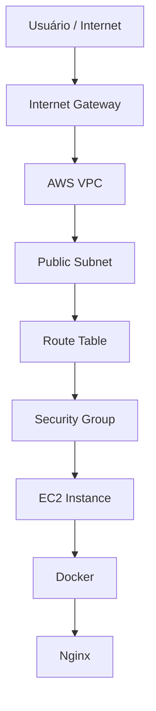
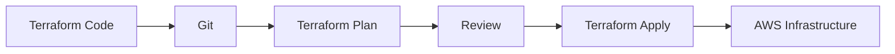
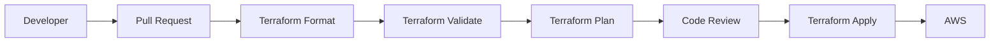

# ☁️ AWS Terraform Infrastructure


Projeto de **Infrastructure as Code (IaC)** utilizando **Terraform** para provisionar uma infraestrutura funcional na **AWS**.

A infraestrutura cria uma rede VPC, subnet pública, Internet Gateway, tabela de rotas, Security Group e uma instância EC2 preparada para executar uma aplicação web containerizada com **Docker + Nginx**.

O objetivo é demonstrar conceitos utilizados em ambientes DevOps, com foco em:

- automação;
- infraestrutura versionada;
- reprodutibilidade;
- segurança de rede;
- cloud computing;
- boas práticas de Infrastructure as Code.

---

# 🎯 Objetivo

Demonstrar o provisionamento automatizado de infraestrutura AWS utilizando Terraform, reduzindo a necessidade de criação manual de recursos pelo console.

Com Infrastructure as Code, a infraestrutura passa a ser:

- versionável;
- reproduzível;
- auditável;
- automatizada;
- reutilizável;
- controlada através de Git.

---

# 🏗️ Arquitetura



## Fluxo da infraestrutura

```text
Internet
   │
   ▼
Internet Gateway
   │
   ▼
AWS VPC
   │
   ▼
Public Subnet
   │
   ▼
Route Table
   │
   ▼
Security Group
   │
   ▼
EC2 Instance
   │
   ▼
Docker
   │
   ▼
Nginx
```

---

# ☁️ Recursos provisionados

O projeto cria os seguintes recursos na AWS.

## VPC

Rede virtual responsável por isolar logicamente os recursos provisionados.

A VPC define o espaço de rede onde os demais componentes da infraestrutura serão executados.

---

## Public Subnet

Subnet pública utilizada para hospedar a instância EC2.

A subnet possui comunicação com a Internet por meio do Internet Gateway e da tabela de rotas.

---

## Internet Gateway

Responsável por permitir comunicação entre os recursos públicos da VPC e a Internet.

---

## Route Table

Define as regras de roteamento da subnet pública.

A tabela de rotas direciona o tráfego externo através do Internet Gateway.

---

## Security Group

Firewall virtual utilizado para controlar o tráfego de entrada e saída da instância EC2.

As regras de acesso podem ser configuradas de acordo com as necessidades da aplicação.

---

## EC2

Instância utilizada como servidor para execução da aplicação.

A instância é provisionada automaticamente pelo Terraform.

---

## Docker

Utilizado para executar a aplicação web dentro de um container.

Isso permite maior isolamento, portabilidade e padronização do ambiente de execução.

---

## Nginx

Servidor web executado dentro do container Docker.

O Nginx é responsável por responder às requisições HTTP da aplicação.

---

# 🛠️ Tecnologias utilizadas

| Tecnologia | Utilização |
|---|---|
| AWS | Cloud Provider |
| Terraform | Infrastructure as Code |
| EC2 | Compute |
| VPC | Networking |
| Subnet | Segmentação de rede |
| Internet Gateway | Acesso externo |
| Route Table | Roteamento |
| Security Group | Segurança de rede |
| Docker | Containerização |
| Nginx | Web Server |
| Git | Versionamento |
| GitHub | Repositório e documentação |

---

# 📁 Estrutura do projeto

A estrutura do projeto contém os arquivos responsáveis pela definição e documentação da infraestrutura.

Exemplo de organização:

```text
aws-terraform-infrastructure/
│
├── main.tf
├── variables.tf
├── outputs.tf
├── provider.tf
├── terraform.tfvars
├── .gitignore
└── README.md
```

> A estrutura pode ser ajustada conforme a evolução do projeto e a separação dos recursos Terraform em novos arquivos ou módulos.

---

# ⚙️ Pré-requisitos

Antes de executar o projeto, é necessário possuir:

- uma conta AWS;
- Terraform instalado;
- AWS CLI instalada;
- credenciais AWS configuradas;
- Git instalado.

---

## Verificar Terraform

```bash
terraform version
```

---

## Verificar AWS CLI

```bash
aws --version
```

---

## Validar autenticação AWS

```bash
aws sts get-caller-identity
```

Esse comando retorna informações sobre a identidade AWS utilizada na sessão atual.

---

# 🚀 Como executar

Primeiro, clone o repositório:

```bash
git clone https://github.com/Pbarbosa4410/aws-terraform-infrastructure.git
```

Entre no diretório:

```bash
cd aws-terraform-infrastructure
```

---

# 1️⃣ Inicializar o Terraform

Execute:

```bash
terraform init
```

Esse comando:

- inicializa o diretório Terraform;
- baixa os providers necessários;
- prepara o projeto para execução.

---

# 2️⃣ Formatar os arquivos

Execute:

```bash
terraform fmt
```

Esse comando formata automaticamente os arquivos Terraform seguindo o padrão oficial da ferramenta.

Também é possível verificar a formatação sem modificar os arquivos:

```bash
terraform fmt -check
```

---

# 3️⃣ Validar a configuração

Execute:

```bash
terraform validate
```

Esse comando verifica se os arquivos Terraform possuem sintaxe e configurações válidas.

Exemplo de retorno esperado:

```text
Success! The configuration is valid.
```

---

# 4️⃣ Visualizar o plano

Execute:

```bash
terraform plan
```

O Terraform apresentará uma prévia das alterações antes de modificar a infraestrutura.

Os símbolos mais comuns são:

```text
+ create
~ update
- destroy
```

O `terraform plan` é uma etapa importante para revisar alterações antes da execução.

---

# 5️⃣ Criar a infraestrutura

Execute:

```bash
terraform apply
```

O Terraform exibirá novamente o plano de execução.

Após revisar os recursos, confirme a operação quando solicitado.

Depois disso, os recursos serão provisionados automaticamente na AWS.

---

# 🌐 Validando a aplicação

Após a criação da infraestrutura, identifique o endereço IP público da instância EC2.

Esse endereço pode ser obtido através:

- dos outputs do Terraform;
- do AWS Console;
- da AWS CLI.

A aplicação pode ser acessada utilizando:

```text
http://IP_PUBLICO
```

Exemplo:

```text
http://192.0.2.10
```

O Nginx executado dentro do container Docker responderá às requisições HTTP.

---

# 🧪 Fluxo de validação Terraform

Antes de aplicar alterações, é recomendado executar:

```bash
terraform fmt -check
```

Depois:

```bash
terraform validate
```

E por último:

```bash
terraform plan
```

O fluxo recomendado é:

```text
Código
   │
   ▼
terraform fmt
   │
   ▼
terraform validate
   │
   ▼
terraform plan
   │
   ▼
Revisão
   │
   ▼
terraform apply
```

Essa abordagem reduz o risco de alterações incorretas na infraestrutura.

---

# 🔐 Segurança

Algumas práticas importantes aplicadas ou consideradas neste projeto:

- infraestrutura definida como código;
- controle de alterações com Git;
- regras de acesso através de Security Groups;
- revisão do `terraform plan` antes da execução;
- credenciais AWS não armazenadas diretamente no código;
- arquivos sensíveis excluídos do versionamento;
- princípio de menor exposição possível dos recursos;
- destruição dos recursos após os testes de laboratório.

---

## Dados que nunca devem ser enviados ao GitHub

Nunca devem ser versionados:

```text
AWS_ACCESS_KEY_ID
AWS_SECRET_ACCESS_KEY
AWS_SESSION_TOKEN
terraform.tfstate
terraform.tfstate.backup
arquivos contendo senhas
arquivos contendo tokens
credenciais de cloud
chaves privadas
```

---

# 📄 Terraform State

O Terraform utiliza um arquivo de state para armazenar informações sobre os recursos provisionados.

Normalmente:

```text
terraform.tfstate
```

Esse arquivo pode conter informações sensíveis sobre a infraestrutura.

Por isso, em ambientes profissionais, é recomendado utilizar um backend remoto e seguro para armazenamento do state.

Uma evolução futura deste projeto será utilizar recursos como:

```text
Amazon S3
+
State Locking
```

para gerenciamento centralizado do Terraform State.

---

# 🧹 Destruindo a infraestrutura

Após finalizar os testes, é possível remover os recursos utilizando:

```bash
terraform destroy
```

O Terraform exibirá os recursos que serão removidos.

Revise o plano apresentado e confirme a execução.

Essa etapa é especialmente importante em ambientes de laboratório para evitar custos desnecessários na AWS.

---

# 🔄 Fluxo Infrastructure as Code



O fluxo demonstra uma abordagem onde as alterações de infraestrutura podem ser:

1. desenvolvidas como código;
2. versionadas;
3. analisadas;
4. validadas;
5. revisadas;
6. aplicadas de maneira controlada.

---

# 🔁 Fluxo DevOps

```text
Developer
    │
    ▼
Terraform Code
    │
    ▼
Git
    │
    ▼
GitHub
    │
    ▼
Terraform Validate
    │
    ▼
Terraform Plan
    │
    ▼
Review
    │
    ▼
Terraform Apply
    │
    ▼
AWS
```

Esse modelo possibilita tratar infraestrutura de forma semelhante ao desenvolvimento de software.

---

# 📚 Conceitos demonstrados

Este projeto demonstra conhecimentos relacionados a:

- AWS;
- Terraform;
- Infrastructure as Code;
- Cloud Computing;
- VPC;
- Subnets;
- Internet Gateway;
- Route Tables;
- Security Groups;
- EC2;
- Docker;
- Nginx;
- Git;
- GitHub;
- Networking;
- Automação;
- Infraestrutura reproduzível;
- Versionamento;
- Troubleshooting;
- Segurança de infraestrutura.

---

# 💡 Boas práticas DevOps

O projeto busca aplicar conceitos importantes utilizados em ambientes DevOps.

## Automação

A infraestrutura é provisionada automaticamente através do Terraform.

---

## Versionamento

Os arquivos de infraestrutura são mantidos no Git.

Isso permite rastrear alterações e retornar a versões anteriores quando necessário.

---

## Reprodutibilidade

O mesmo código Terraform pode ser utilizado para recriar a infraestrutura.

---

## Revisão

O `terraform plan` permite revisar as alterações antes da aplicação.

---

## Documentação

O próprio repositório documenta a arquitetura e o processo de provisionamento.

---

## Segurança

Credenciais e informações sensíveis não devem ser armazenadas no código-fonte.

---

# 🧠 Troubleshooting

Durante a execução de projetos Terraform, alguns problemas comuns podem ocorrer.

## Erro de autenticação AWS

Valide as credenciais utilizando:

```bash
aws sts get-caller-identity
```

---

## Provider não inicializado

Execute:

```bash
terraform init
```

---

## Erro de sintaxe Terraform

Execute:

```bash
terraform validate
```

---

## Arquivos fora do padrão

Execute:

```bash
terraform fmt
```

---

## Visualizar alterações antes da execução

Execute:

```bash
terraform plan
```

---

# 🔭 Próximas evoluções

O projeto poderá evoluir com a implementação de recursos mais próximos de ambientes corporativos.

Entre as próximas melhorias:

- módulos Terraform reutilizáveis;
- backend remoto;
- Terraform State em S3;
- state locking;
- separação de ambientes;
- CI/CD com GitHub Actions;
- validação automática de Terraform;
- múltiplas subnets;
- subnets privadas;
- Application Load Balancer;
- Auto Scaling;
- IAM Roles;
- CloudWatch;
- RDS;
- NAT Gateway;
- criação de módulos de networking;
- análise de segurança;
- pipeline de Infrastructure as Code.

---

# 🗂️ Evolução para múltiplos ambientes

Uma futura organização poderá utilizar ambientes separados.

Exemplo:

```text
environments/
│
├── dev/
├── hml/
└── prod/
```

E módulos reutilizáveis:

```text
modules/
│
├── vpc/
├── ec2/
├── security-group/
└── networking/
```

Essa abordagem melhora:

- reutilização;
- manutenção;
- padronização;
- organização;
- escalabilidade do código Terraform.

---

# 🤖 CI/CD futuro

Uma evolução importante será integrar Terraform com GitHub Actions.

Fluxo planejado:



Esse fluxo permitirá validar automaticamente alterações na infraestrutura antes da aplicação.

---

# 📊 Benefícios do projeto

A utilização de Terraform neste laboratório permite demonstrar:

- criação automatizada de recursos AWS;
- redução de tarefas manuais;
- versionamento da infraestrutura;
- padronização de ambientes;
- maior rastreabilidade;
- repetibilidade;
- documentação;
- integração futura com CI/CD.

---

# 💡 Aprendizados

O desenvolvimento deste projeto permite praticar o ciclo completo de Infrastructure as Code:

```text
Código
   ↓
Terraform Init
   ↓
Terraform Format
   ↓
Terraform Validate
   ↓
Terraform Plan
   ↓
Terraform Apply
   ↓
AWS Infrastructure
   ↓
Validação
   ↓
Terraform Destroy
```

Além do provisionamento, o projeto reforça um princípio importante de DevOps:

> Infraestrutura deve ser tratada como código.

Isso significa aplicar à infraestrutura conceitos já utilizados no desenvolvimento de software, como:

- versionamento;
- revisão;
- automação;
- rastreabilidade;
- documentação;
- padronização.

---

# 👨‍💻 Autor

**Paulo Barbosa**

**DevOps & Cloud Engineer**

Foco profissional em:

- AWS
- Terraform
- Kubernetes
- Docker
- CI/CD
- GitHub Actions
- Jenkins
- Observability
- Prometheus
- Grafana
- Automation
- DevSecOps

GitHub: [Pbarbosa4410](https://github.com/Pbarbosa4410)

---

⭐ Este projeto faz parte do meu portfólio prático de **DevOps & Cloud Engineering**.
